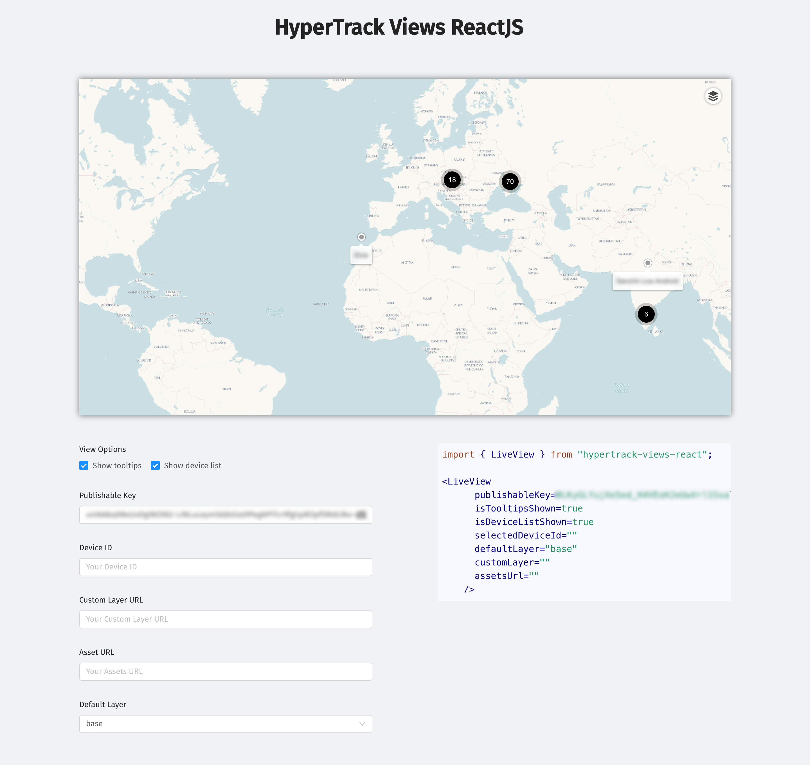
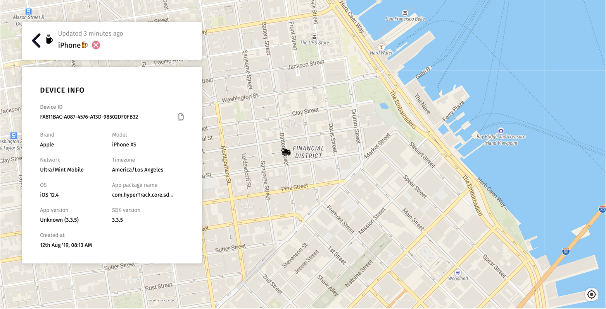

# HyperTrack Views for ReactJS

A wrapper for views provided through the [HyperTrack dashboard](https://dashboard.hypertrack.com/). It allows you to integrate the same views into your own application.

> Please check out the [Views Guide](https://docs.hypertrack.com/#views) for a closer look at the capabilities provided by HyperTrack Views.


## Prerequisites

- Set up a HyperTrack account and obtain your [Publishable Key from the Dashboard](https://dashboard.hypertrack.com/setup)
- Integrate the HyperTrack SDK in your application ([iOS](https://github.com/hypertrack/quickstart-ios), [Android](https://github.com/hypertrack/quickstart-android), or [React Native](https://github.com/hypertrack/quickstart-react-native)) or use our sample app to send location data ([iOS](https://github.com/hypertrack/live-app-ios) or [Android](https://github.com/hypertrack/live-app-android))

## Explore sample app

You can use the sample app provided to explore the capabilities and usage of this component. Please [visit this page to open the sample app](https://hypertrack.github.io/views-react/).

To run the sample app on your own, follow these steps:

Jump to the sample app folder:

```shell
cd sample
```

Install all app dependencies:

```shell
npm i

yarn
```

> Note: Do not run the installation in the root folder. If that has been done before sample app dependecies were installed, NPM will use installed packages from the root node_modules, which might reason conflicts and break the build process

Run the sample app:

```shell
node run start

yarn start
```

The CLI will open up the locally hosted sample app (`http://localhost:3000/`) and should look like this:


## Installation

You can use either Yarn or NPM to add `hypertrack-views-react` to your project:

```shell
npm install --save hypertrack-views-react

yarn add hypertrack-views-react
```

## Usage

```javascript
import { LiveView } from "hypertrack-views-react";

const PUBLISHABLE_KEY = "<your_key>";

<LiveView
  publishableKey={PUBLISHABLE_KEY}
  showTooltips={true}
  showDeviceList={false}
  showDeviceCard={false}
  selectedDeviceId={"00112233-4455-6677-8899-AABBCCDDEEFF"}
  defaultLayer={"custom"}
  customLayerUrl={"http://mt2.google.com/vt/lyrs=s&x={x}&y={y}&z={z}"}
  assetsUrl={"https://abc-sdk-test-assets.s3-us-west-2.amazonaws.com/"}
/>;
```

## Configuration

| Property         | Type    | Default | Description                                                                                                                                                                                                                                                 |
| ---------------- | ------- | ------- | ----------------------------------------------------------------------------------------------------------------------------------------------------------------------------------------------------------------------------------------------------------- |
| publishableKey   | string  | N/A     | The publishable key of your account from the [Setup page on the Dashboard](https://dashboard.hypertrack.com/setup)                                                                                                                                          |
| showTooltips     | boolean | `false` | Show the device ID right next to the location marker of a device                                                                                                                                                                                            |
| showDeviceList   | boolean | `true`  | Show the list of all tracked devices, includes filter and search options. A click on a device will place zoom to the device location                                                                                                                        |
| showDeviceCard   | boolean | `true`  | Show the device detail card on the single device view                                                                                                                                                                                                       |
| selectedDeviceId | string  | `null`  | ID of the device to be displayed (case sensistive). Can be obtained using the [Device API](https://www.hypertrack.com/docs/references/#references-apis-devices). Adding this will change the view to a single device mode (including device data, activity, and more)                  |
| defaultLayer     | string  | `base`  | Can be either one of: [`base`](https://cloud.maptiler.com/maps/voyager/), [`street`](https://cloud.maptiler.com/maps/streets/), [`satellite`](https://cloud.maptiler.com/maps/hybrid/), or `custom`. Custom will only work if a customLayerUrl is provided. |
| customLayerUrl   | string  | `null`  | URL to a Leaflet-compatible [tiled web map](https://en.wikipedia.org/wiki/Tiled_web_map) in XYZ format. Only raster is supported and it needs to be public accessible.                                                                                      |
| assetsUrl        | string  | `null`  | URL to a public asset folder containig SVG files to replace default icons. The filenames need to match exactly. Missing icons will show the default versions.                                                                                               |

> Note: The component passes along all additional properties, so you can use properties like `className`.

#### Showing a single device

When provided with the `selectedDeviceId` property, the component will render a single device view as opposed to the device overview.



> The device info card on the left side can be disabled by setting `showDeviceCard` to `false`

#### Adding a custom map layer

With the `customLayerUrl` property, you can reference a raster tile to be added as a custom map layer. Users can select the custom view from the  button on the top right side of the view. The layer is pre-selected based on the `defaultLayer` property. After setting the `customLayerUrl`, you can set the `defaultLayer` property to `custom` to render this new tile by default.

There are different ways to obtain and/or generate a custom layer. [OpenMapTiles](https://openmaptiles.org/) might be of interest. You can also generate/customize [MapBox maps and access them as raster tiles](https://docs.mapbox.com/api/maps/#raster-tiles).

> Note: Please ensure you use the XYZ URL format, which looks something like this: `/tile-name/{z}/{x}/{y}.png`

Here are some sample layer tiles:

| Layer                        | URL                                                         | Preview                                                                   |
| ---------------------------- | ----------------------------------------------------------- | ------------------------------------------------------------------------- |
| Google Maps: Satellite       | `http://mt0.google.com/vt/lyrs=s&x={x}&y={y}&z={z}`         |  |
| Google Maps: Roadmap/Streets | `http://mt0.google.com/vt/lyrs=m&hl=en&x={x}&y={y}&z={z}`   |      |
| Google Maps: Hybrid          | `http://mt0.google.com/vt/lyrs=s,h&hl=en&x={x}&y={y}&z={z}` |        |

#### Replacing default icons

By default, the views display a set of icons to indicate status, activity, and more. You can replace each icon individually. Below is a list of all the replaceable icons.

> **Original Icons**: You can use the [default icons](i) and make your modifications

| Filename             | Default                                                                                                     | Description                                               |
| -------------------- | ----------------------------------------------------------------------------------------------------------- | --------------------------------------------------------- |
| `live-direction.svg` |  | Dot indicated the live location and direction of a device |
| `live.svg`           |                      | Dot indicated the live location of a device               |
| `offline.svg`        |                | Dot indicated the last known location of a device         |
| `walk.svg`           |                      | Activity icon for walking activity                        |
| `run.svg`            |                        | Activity icon for running activity                        |
| `cycle.svg`          |                    | Activity icon for cycling activity                        |
| `drive.svg`          |                    | Activity icon for driving activity                        |
| `stop.svg`           |                      | Activity icon for stopping activity                       |
| `unknown.svg`        |                | Activity icon for unknown activity                        |
| `inactive.svg`       |              | Status icon for inactive device                           |
| `disconnected.svg`   |      | Status icon for disconnected device                       |

## Versioning

We use [Semantic Versioning](http://semver.org/). For the versions available, see the [tags on this repository](https://github.com/hypertrack/views-react/tags).

## License

This project is licensed under the MIT License - see the [LICENSE](LICENSE) file for details
